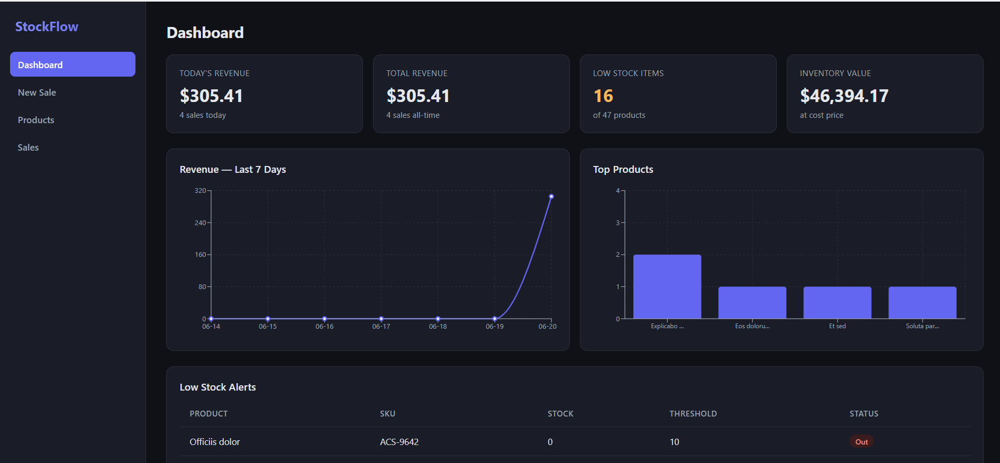
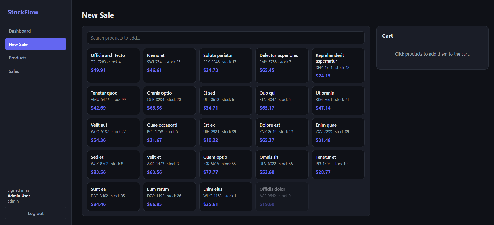
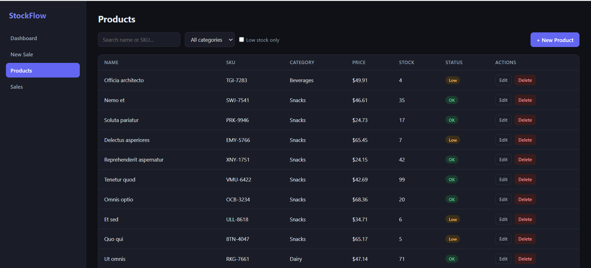
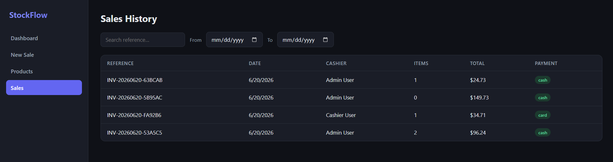

# StockFlow — Inventory & Point-of-Sale System

A full-stack inventory management and POS application built with **Laravel 11** and **React**. Admins manage products and view analytics; cashiers ring up sales through an interactive point-of-sale screen. Stock is tracked in real time, and every sale is processed through a transactional engine that prevents overselling.

## Features

- **Token-based authentication** (Laravel Sanctum) with **role-based authorization** (admin / cashier)
- **Product management** — full CRUD with image upload, SKU, pricing, and stock tracking
- **Search & filtering** — by name/SKU, category, and low-stock status, with pagination
- **Point of Sale** — interactive cart, live totals, payment + change, instant receipt
- **Transactional sale engine** — validates stock, deducts inventory atomically, generates invoice references, and stores line-item price snapshots
- **Sales history** — searchable, date-filterable, with full receipt detail view
- **Analytics dashboard** — revenue, sales counts, inventory value, low-stock alerts, and charts (revenue over time, top products)

## Tech Stack

**Backend:** Laravel 11, Laravel Sanctum, MySQL
**Frontend:** React (Vite), React Router, Axios, Recharts

## Architecture Highlights

- **Clean separation:** Form Requests for validation, API Resources for response shaping, a dedicated Service class for sale processing
- **Transaction safety:** sales run inside a DB transaction with row-level locking (`lockForUpdate`) to prevent race conditions and overselling
- **Server-side trust:** sale totals are computed from the database, never from the client payload
- **Defense in depth:** authorization enforced by backend middleware *and* mirrored in frontend route guards
- **Efficient analytics:** dashboard stats use SQL aggregation (SUM/COUNT/GROUP BY), not in-memory loops

## Project Structure

\`\`\`
stockflow-inventory-system/
├── backend/      # Laravel 11 REST API
├── frontend/     # React (Vite) SPA
└── screenshots/  # README images
\`\`\`

## Getting Started

### Prerequisites
- PHP 8.2+ and Composer
- Node.js 18+ and npm
- MySQL

### Backend Setup

\`\`\`bash
cd backend
composer install
cp .env.example .env
php artisan key:generate
\`\`\`

Create a MySQL database called \`stockflow\`, then set your credentials in \`.env\`:

\`\`\`env
DB_DATABASE=stockflow_db
DB_USERNAME=root
DB_PASSWORD=
\`\`\`

Run migrations and seed demo data:

\`\`\`bash
php artisan migrate:fresh --seed
php artisan storage:link
php artisan serve
\`\`\`

The API runs at \`http://127.0.0.1:8000\`.

### Frontend Setup

\`\`\`bash
cd frontend
npm install
npm run dev
\`\`\`

The app runs at \`http://localhost:5173\`.

## Demo Credentials

| Role    | Email                   | Password    |
| ------- | ----------------------- | ----------- |
| Admin   | admin@stockflow.test    | password123 |
| Cashier | cashier@stockflow.test  | password123 |

## API Overview

| Method | Endpoint                      | Access  | Description                  |
| ------ | ----------------------------- | ------- | ---------------------------- |
| POST   | /api/login                    | Public  | Authenticate, returns token  |
| POST   | /api/logout                   | Auth    | Revoke current token         |
| GET    | /api/products                 | Auth    | List (search/filter/paginate)|
| POST   | /api/products                 | Admin   | Create product               |
| PUT    | /api/products/{id}            | Admin   | Update product               |
| DELETE | /api/products/{id}            | Admin   | Delete product               |
| GET    | /api/categories               | Auth    | List categories              |
| POST   | /api/sales                    | Auth    | Process a sale               |
| GET    | /api/sales                    | Auth    | Sales history                |
| GET    | /api/dashboard/summary        | Admin   | Dashboard stats              |

## Screenshots

### Point of Sale

### Products Management

### Sales History

## License

Open source, free to use for learning purposes.